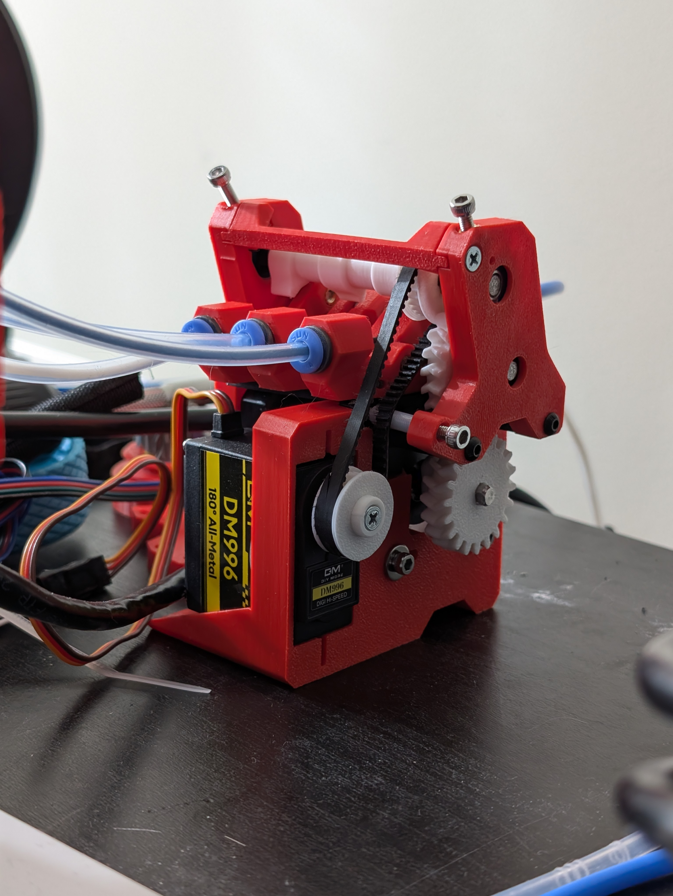

# LH PICO MMU

# What is it
The Pico MMU is a very cost effective and compact multi material system. 



# How does it work?

## What printers are supported

## What do I need to get started



# BOM
| **Item** | **Quantity** |
|--------------------------------|-----------|
| EMAX ES3004 Servo (EMAX) |	1 |
| Nema 17 (max 40mm length) |	1 |
| Steel D-Shaft 5mm x 72mm or 90m for 4 lanes |	2 |
| Bearing MR115 |	4 |
| Bearing MR83 |	3 (4)* |
| BMG Drive Gear (with grub screw) |	3 (4)* |
| PTFE Tube 4mm OD, 3mm ID |	1 |
| ECAS 4 Collet |	6 (8)* |
| Belt GT2 ~20cm |	1 (Belt Drive)**|
| Heat Insert M3 5mm (D) x 4mm (L) |	20 (23)* |
| Screw Cap Head M3 10mm |	3 |
| Screw Cap Head M3 22mm |	2 |
| Screw Cap Head M3 30mm |	2 |
| Screw Cap Head M3 8mm |	2 |
| Screw Countersunk M3 10mm |	12 |
| Screw Countersunk M3 16mm |	4 |
| Screw Countersunk M3 8mm |	1 |
| Screw Grub M3 6mm (optional) |	2 |

# Printed parts

The offical print files can be found on github: [Print files](https://github.com/lhndo/LH-Stinger/tree/main/User_Mods/MMU/Stinger%20Pico%20MMU%20-%20%40LH){ .md-button}



# Assembly/build

# Testing/tuning

# Customization / modifications



