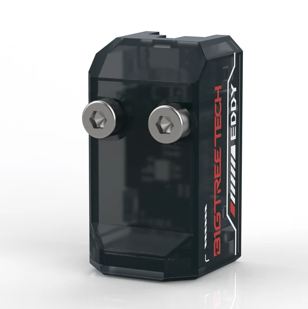
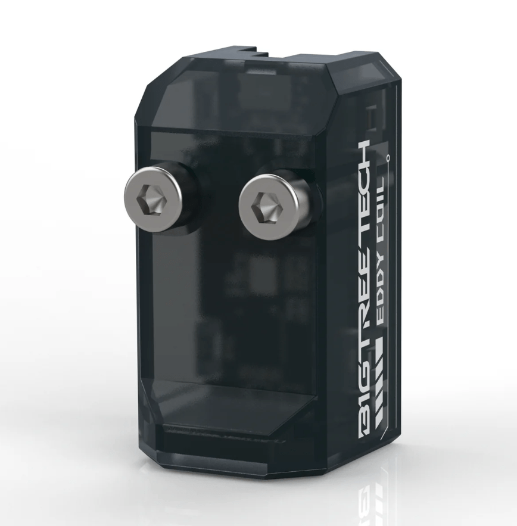
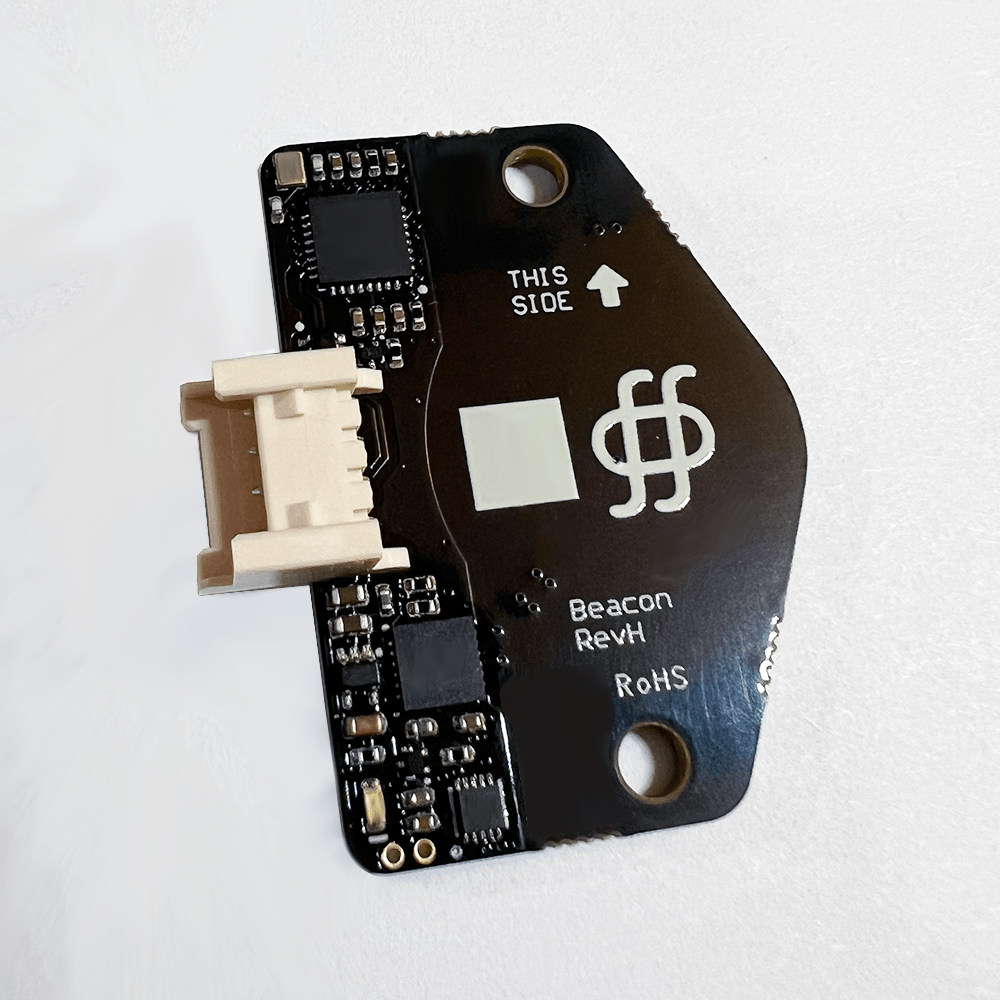

# Bed Leveling { #bed-leveling }

Bed leveling is a crucial process that ensures the print bed surface is perfectly aligned with the printer's nozzle across the entire build area. Proper bed leveling is essential for:

- Consistent first layer adhesion
- Accurate print dimensions
- Prevention of nozzle clogs
- Overall print quality and reliability

## Mesh Leveling { #mesh-leveling }

Mesh leveling (also known as "mesh bed leveling") creates a virtual map of your printer's bed by measuring its surface at multiple points. This allows the printer to dynamically adjust the nozzle height during printing, compensating for any unevenness in the bed surface.

### How Mesh Leveling Works

1. The printer probes multiple points across the bed surface
2. Creates a height map of the bed
3. Adjusts the Z-axis dynamically during printing
4. Compensates for bed warping and unevenness

!!! tip "Best Practices"
    - Perform mesh leveling at operating temperature
    - Clean the bed surface before leveling
    - Use a sufficient number of probe points for your bed size
    - Recalibrate after significant changes to the printer

## Bed Leveling Sensors { #sensors }

### Electric Coil Sensors { #electric-coil }

These sensors use electromagnetic induction to detect the bed surface without physical contact.

| Sensor | Image | Key Features | More Info |
|:-------|:-----:|:------------|:----------|
| [Eddy](eddy.md) |  | - USB connectivity - High precision - Non-contact | [Details](eddy.md) |
| [Eddy Coil](eddy-coil.md) |  | - I2C interface - Compact design - Fast response | [Details](eddy-coil.md) |
| [Beacon3D](beacon.md) |  | - Multiple sensing modes - Auto Z-offset - High accuracy | [Details](beacon.md) |
| [Cartographer](cartographer.md) |  | - Advanced algorithms - Multi-material support - Fast scanning | [Details](cartographer.md) |

### Physical Contact Sensors { #physical-sensors }

These sensors make physical contact with the bed surface to measure its position.

| Sensor | Image | Key Features | More Info |
|:-------|:-----:|:------------|:----------|
| BLTouch |  | - Reliable mechanical probe - Self-testing - Wide compatibility | [Details](bltouch.md) |
| Beacon3D Poke |  | - Dual-mode operation - Auto-calibration - High precision | [Details](beacon.md) |
| Inductive Probe |  | - Metal bed detection - Fast response - Durable design | [Details](inductive.md) |
| Klicky |  | - Open source - Easy to build - Accurate results | [Details](klicky.md) |

## Auto Z-Offset { #auto-z-offset }

Auto Z-offset systems automatically calibrate the distance between the nozzle and the bed surface.

### Available Solutions

| System | Image | Key Features | More Info |
|:-------|:-----:|:------------|:----------|
| Beacon3D Poke |  | - Automatic calibration - Real-time adjustment - Multi-material support | [Details](beacon.md) |
| Eddy Auto-Z |  | - Non-contact measurement - High precision - Fast response | [Details](eddy.md) |

## Configuration Tips { #configuration-tips }

!!! note "Important Settings"
    - Set appropriate probe points for your bed size
    - Configure proper probe offsets
    - Enable mesh leveling in your slicer
    - Set appropriate Z-offset values

!!! warning "Common Issues"
    - Incorrect probe offsets
    - Dirty bed surface
    - Loose probe mounting
    - Incorrect Z-offset

## Related Resources { #related-resources }

- [Klipper Documentation](https://www.klipper3d.org/Bed_Level.html)
- [Voron Discord](https://discord.gg/voron)
- [GitHub Discussions](https://github.com/VoronDesign/VoronUsers/discussions)


