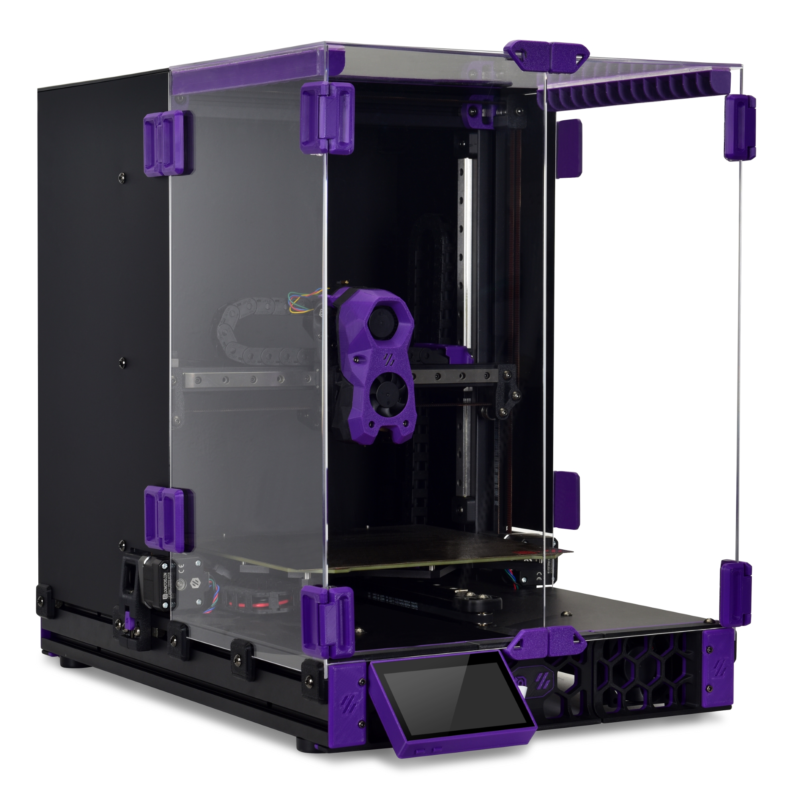
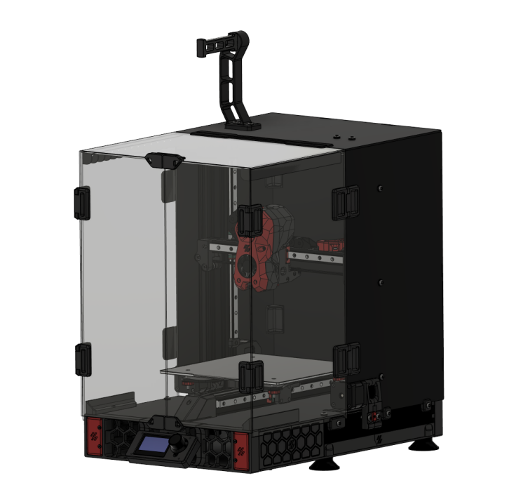

# Voron Printers

## Overview

Voron Design offers a range of high-performance 3D printers, each designed for specific use cases and requirements. This guide covers the official Voron printer models, their features, applications, and notable community derivatives. Print speeds and acceleration have been removed as those are dependent on how well a voron is built.

---

## Official Models

### [Voron V0.2r1](./v0/v0.md)

<table>
  <tr>
    <th>Specification</th>
    <th>Details</th>
  </tr>
  <tr>
    <td>Type</td>
    <td>Compact CoreXY</td>
  </tr>
  <tr>
    <td>Build Volume</td>
    <td>120mm³</td>
  </tr>
  <tr>
    <td>Key Features</td>
    <td>Small footprint, high-speed printing, CoreXY motion, fully enclosed, ideal for small parts and prototyping</td>
  </tr>
  <tr>
    <td>Purchase Link</td>
    <td><a href="https://s.click.aliexpress.com/e/_oBMsO7V">FormBot V0.2r1 kit</a></td>
  </tr>
</table>

---

### [Voron V2.4](./2.4/v2-4.md)

<table>
  <tr>
    <th>Specification</th>
    <th>Details</th>
  </tr>
  <tr>
    <td>Type</td>
    <td>Flagship CoreXY with flying gantry</td>
  </tr>
  <tr>
    <td>Build Volume</td>
    <td>250mm³, 300mm³*, 350mm³*</td>
  </tr>
  <tr>
    <td>Key Features</td>
    <td>Flying gantry, CoreXY motion, advanced customization, input shaping ready, top performance</td>
  </tr>
  <tr>
    <td>Purchase Link</td>
    <td><a href="https://s.click.aliexpress.com/e/_omeAe5D">FormBot V2.4 kit</a></td>
  </tr>
</table>

---

### [Voron Trident](./trident/trident.md)

<table>
  <tr>
    <th>Specification</th>
    <th>Details</th>
  </tr>
  <tr>
    <td>Type</td>
    <td>Fixed gantry CoreXY</td>
  </tr>
  <tr>
    <td>Build Volume</td>
    <td>250mm³, 300mm³*, 350mm³*</td>
  </tr>
  <tr>
    <td>Key Features</td>
    <td>Fixed gantry for stability, CoreXY, three-point Z leveling, excellent print quality, simplified maintenance</td>
  </tr>
  <tr>
    <td>Purchase Link</td>
    <td><a href="https://s.click.aliexpress.com/e/_ooXQ0I3">FormBot Trident kit</a></td>
  </tr>
</table>

---

### [Voron Switchwire](switchwire.md)

<table>
  <tr>
    <th>Specification</th>
    <th>Details</th>
  </tr>
  <tr>
    <td>Type</td>
    <td>Bed Slinger</td>
  </tr>
  <tr>
    <td>Build Volume</td>
    <td>235mm³</td>
  </tr>
  <tr>
    <td>Key Features</td>
    <td>CoreXZ motion, compact design, direct drive extruder, fully enclosed, great Voron entry point</td>
  </tr>
</table>

---

## Community Derivatives

### [Enderwire](https://github.com/RobotRogue/Enderwire_Docs)

<table>
  <tr>
    <th>Specification</th>
    <th>Details</th>
  </tr>
  <tr>
    <td>Type</td>
    <td>CoreXZ Conversion</td>
  </tr>
  <tr>
    <td>Build Volume</td>
    <td>235mm³ (220mm*)</td>
  </tr>
  <tr>
    <td>Key Features</td>
    <td>Ender 3 conversion, CoreXZ motion, fully enclosed, cost-effective upgrade, active community support</td>
  </tr>
  <tr>
    <td>Purchase Link</td>
    <td><a href="https://s.click.aliexpress.com/e/_opZaYvv">Siboor Enderwire kit</a></td>
  </tr>
</table>

---

### [Micron (plus)](salad-forks/micron.md)

<table>
  <tr>
    <th>Specification</th>
    <th>Details</th>
  </tr>
  <tr>
    <td>Type</td>
    <td>CoreXZ Conversion</td>
  </tr>
  <tr>
    <td>Build Volume</td>
    <td>185mm³</td>
  </tr>
  <tr>
    <td>Key Features</td>
    <td>A smaller Voron 2.4, using 1515 aluminum extrusions, with a flying gantry, fully enclosed</td>
  </tr>
  <tr>
    <td>Purchase Link</td>
    <td><a href="https://s.click.aliexpress.com/e/_oFJRybd">Formbot Micron Plus kit</a></td>
  </tr>
</table>

---

### [Sovol SV08](https://github.com/Sovol3d/SV08)

<table>
  <tr>
    <th>Specification</th>
    <th>Details</th>
  </tr>
  <tr>
    <td>Type</td>
    <td>CoreXY</td>
  </tr>
  <tr>
    <td>Build Volume</td>
    <td>300x300x350mm</td>
  </tr>
  <tr>
    <td>Key Features</td>
    <td>Based on Voron V2.4, CoreXY motion, fully enclosed, commercial availability</td>
  </tr>
</table>

---

### [Voron Legacy](./legacy/legacy.md)

<table>
  <tr>
    <th>Specification</th>
    <th>Details</th>
  </tr>
  <tr>
    <td>Type</td>
    <td>Legacy CoreXY</td>
  </tr>
  <tr>
    <td>Build Volume</td>
    <td>250mm³</td>
  </tr>
  <tr>
    <td>Key Features</td>
    <td>Original Voron design, CoreXY motion, community support, historical significance</td>
  </tr>
</table>

---

## Related Resources

* [Voron Design GitHub](https://github.com/VoronDesign)
* [Voron Discord](https://discord.gg/voron)
* [Voron Subreddit](https://www.reddit.com/r/voroncorexy)
* [Voron Community Forums](https://forum.vorondesign.com)

---

## References

1. Voron Design Documentation
2. Community Modifications Database
3. User Experience Reports
4. Manufacturer Documentation


