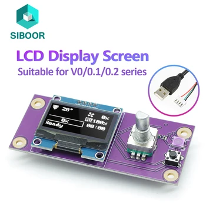

# Voron V0

Official Voron Design link: [https://vorondesign.com/voron0](https://vorondesign.com/voron0)

Below is a generic image of what a Voron V0 can look like. Like all Voron 3D printers, the V0 can be highly customized to create whatever type of printer you would like.

## What is a V0

The Voron V0 is a small 3D printer with a build area of 120mm³. This printer, like most Vorons, uses a CoreXY motion system where the bed moves as part of the Z-axis on a single lead screw.

## BOM

??? info "Offical Voron V0.2 R1 bill of materials"
     

## Hardware for the V0

### Displays

| Name                              | Description                                 | Documentation/Info                                                                 | Purchase Link         |
|-----------------------------------|---------------------------------------------|------------------------------------------------------------------------------------|----------------------|
| Siboor Voron V0 Simple Display    |                         | [Docs](https://docs.siboor.com/other-products/v0-display-screen)                   | [Buy](https://s.click.aliexpress.com/e/_omW4YFY) |
| Fysetc Voron V0 Display           | Simple display for V0                       | [Docs](https://docs.siboor.com/other-products/v0-display-screen)                   | [Buy](https://s.click.aliexpress.com/e/_o2DBTEa) |

### Toolhead Boards

| Name                  | Description                                                                 | Documentation/Info | Purchase Link |
|-----------------------|-----------------------------------------------------------------------------|--------------------|---------------|
| M36-HUB Toolhead Board| Shipped to customers, but documentation pulled by Fysetc. Not acknowledged. | *(No docs)*        | [Buy](https://s.click.aliexpress.com/e/_omQ3Zi6)  |
| Umbilical Toolheadboard| Official Voron Design team toolhead board and umbilical design              | [GitHub](https://github.com/VoronDesign/Voron-Hardware/blob/master/V0-Umbilical/README.md) | [Buy](https://s.click.aliexpress.com/e/_ole8MZ4)  |

### Mainboards

| Name                   | Description                                               | Documentation/Info                                                                                                    | Purchase Link |
|------------------------|-----------------------------------------------------------|----------------------------------------------------------------------------------------------------------------------|---------------|
| Catalyst V1.0 Mainboard| Created for Voron V0, comes with its own toolhead board   | [Wiring PDF](https://github.com/FYSETC/FYSETC-Voron-0.2-Pro/blob/main/0.2%20R1/Fysetc%20Voron%20V0.2%20R1%20umbilical%20Wiring.pdf) | *(Add link)*  |
| Catalyst V2.0 Mainboard| Latest board for Voron V0 by Fysetc                      | [GitHub](https://github.com/FYSETC/Catalyst_Kit_V2.0)                                                                | [Buy](https://s.click.aliexpress.com/e/_oocFQly)  |
| BTT SKR PICO V1.0 Mainboard| BigTreeTech SKR PICO V1.0 mainboard for Voron V0       | coming soon                                                                              | coming soon |

### Metal Bed Replacements
| Name                   | Description                                               | Documentation/Info |Purchase Link |
|------------------------|-----------------------------------------------------------|-----------------------------------|
| Fysetc CNC bed| Created for Voron V0, made out of cnc aluminum   | [Buy](https://s.click.aliexpress.com/e/_c3vtwR6X) |
| kirigami | Sheet metal foldered, simpler than the stock design but many users complain about bed sag| [Buy](https://s.click.aliexpress.com/e/_c3hjI3gT)    |

## Voron V0 Kits

| Name           | Description | Purchase Link |
|----------------|-------------|--------------|
| Formbot Kit    | Voron V0 kit from Formbot | [Buy](https://s.click.aliexpress.com/e/_oCFz74T) |
| Siboor Kit     | Voron V0 kit from Siboor  | [Buy](https://s.click.aliexpress.com/e/_oFWpi3H) |
| Fysetc - France Store | Voron V0 kit from Fysetc France | [Buy](https://s.click.aliexpress.com/e/_opnBDl9) |
| LDO KIT  | Voron V0 kit from LDO motors seen by many as the highest quality and ore polished kit |[Buy](https://west3d.com/products/ldo-voron-v0-2-s1-complete-kit-voron-v0-2/?dt_id=2902688%3Bap%3A1878203) |

### Formbot Voron v0 kit review

??? note
    We are working on the assumption that all voron v0 kits will have all the parts exept the printed components that are needed to assemble a voron v0, The pros and cons are specifically pointing out things that kits do better or worse than the stock voron v0 bom

| Pros | Cons |
| ---- | ---- |
| low price | umbilical cable prone to breaking |
| BTT SKR PICO | BTT PI 1.2 |
| moons motors | fans prone to failure |
| kirigami bed | bed heater cables not cut to length |

### Fysetc Voron v0 Kit review

??? note
    We are working on the assumption that all voron v0 kits will have all the parts exept the printed components that are needed to assemble a voron v0, The pros and cons are specifically pointing out things that kits do better or worse than the stock voron v0 bom

| Pros | Cons |
|----|----|
| low price | Catalyst v3 MCU |
| lightweight CNC X extrusion replacement | M36 toolhead board|
| Fysetc CNC bed frame| fysetc branded motors |
| Bed heater cut to length for wagos| Weak fans |

### Siboor Voron V0 kit
* coming soon (reach out on discord if you would like to write this section)*

### LDO Voron V0 kit
* coming soon (reach out on discord if you would like to write this section)*

## Modifications / Add-ons

### Toolheads
*Big Thank you to [chirpy2605](https://github.com/chirpy2605/voron/blob/main/README.md) for creating these toolhead designes and sharing them with the community, please be sure to give him a star of git hub and donate if you can*

- [Yavoth Toolhead](https://github.com/chirpy2605/voron/tree/main/V0/Yavoth)
  - This is a toolhead for High and Ultra High Flow style hotends using angled 4010 part cooling fans and a 2510 hotend fan

-[Dragon Burner Toolhead](https://github.com/chirpy2605/voron/tree/main/V0/Dragon_Burner)
  - a very popular alternative toolhead for the voron v0 that increases cooling with two 4010 fans
  - Voron and  [Printers for Ants](https://3dprintersforants.com/) toolhead using 2 4010 part cooling fans and a 3010 fan for most hotends including the Dragon High Flow, Rapido High Flow and Revo Voron

- [Rapid Burner Toolhead](https://github.com/chirpy2605/voron/tree/main/V0/Rapid_Burner)
  - Voron and [Printers for Ants](https://3dprintersforants.com/) toolhead has been specifically designed for the Rapido UHF, Dragon UHF, Goliath Air and Goliath Water hotends and uses 2 4010 part cooling fans and a 3010 hotend fan

- [Mailbox Toolhead](https://github.com/chirpy2605/voron/tree/main/V0/Mailbox)
  - Voron and [Printers for Ants](https://3dprintersforants.com/) toolhead using 1 5015 part cooling fans and a 3010 fan for most hotends including the Dragon High Flow, Rapido High Flow and Revo Voron

- [Rainbow Dragon](https://github.com/chirpy2605/voron/tree/main/V0/Rainbow_Dragon)
  - This toolhead is a dual filament extruder for Voron and various [Printers for Ants](https://3dprintersforants.com/). It has been specifically designed for the Phaetus TaiChi dual filament hotend

- [StovePipe Toolhead](https://github.com/chirpy2605/voron/tree/main/V0/StovePipe)
  - v0.1 and [Printers for Ants](https://3dprintersforants.com/) toolhead using a 7040 CPAP fan for part cooling

.jpg)

### Frame Modifications

| Name            | Description                       | Image                                         | Links                   |
|-----------------|-----------------------------------|-----------------------------------------------|------------------------------------|
| LDO Mini Fridge door   | Mod for fridge-style door on Voron V0   |     | [Mini Fridge repo](https://github.com/TheVoronModder/MiniFridge)   [Larger latch](https://www.printables.com/model/1097609-voron-02-mini-fridge-ldo-formbot-inner-door-latch/comments) |
| Zero Panel                              | Replacement for drop nuts to mount side panels  | *(no image provided)*                                                                 | [Zero Panel repo](https://github.com/zruncho3d/ZeroPanels)                                                                                                              |
| BoxZero                                 | A box-framed Voron V0                         |  | [BoxZero repo](https://github.com/zruncho3d/BoxZero)                                                                                                                    |

### XY Motion Modifications

| Name   | Description                              | Image                                                                                                                                                                      | Links |
|------------------------------------------------------------------------------------------------|--------------------------------------------------------------------------------------------------------------------------------------------------|--------------------------------------------------------------------------------------------------------------------------------------------------------------------------|-------|
| [Tulip](https://github.com/Amekyras/tulip/tree/main)                                           | A very interesting project to switch the Voron V0 to front-mounted belt tensioners, reducing the force placed on the stepper motor shaft          | *(no image provided)*                                                                                                                                                     |       |
| [Pandora](https://github.com/MasturMynd/Pandora)                                               | A gantry mod for the Voron V0 that allows 142 mm of X travel and 127 mm of Y travel within the stock frame                                       |                                       |       |

### Printers based on the V0

!!!+ tip "Changes Coming soon"
    These printers will be moving to a new page soon

| Name                                                                                     | Description                                 | Image                                                                                                                                                         | Links |
|------------------------------------------------------------------------------------------|-------------------------------------------|---------------------------------------------------------------------------------------------------------------------------------------------------------------|-------|
| [Tri-Zero](https://github.com/zruncho3d/tri-zero)                                        | Triple independent belted Z with mesh leveling |                                         |       |
| [Hex-Zero](https://github.com/Alexander-T-Moss/Hex-Zero)                                 | Triple independent belted Z with mesh leveling |                    |       |
| [SugarCube](https://github.com/ruiqimao/SugarCube/tree/main)                                 |  |               |       |
| [Pandora's box](https://github.com/MasturMynd/Pandoras_Box)                                 | |            |       |

### Other Modifications

| Name                                                                                                           | Description        | Image                   | Links |
|----------------------------------------------------------------------------------------------------------------|--------------------|-------------------------|-------|
| [Upper Rear Bowden Inlet](https://github.com/MapleLeafMakers/V0_Upper_Rear_Bowden_Inlet)                      | *(no description)* | *(no image provided)*   |       |
| [Umbilical Collar](https://github.com/MapleLeafMakers/V0_Umbilical_Collar)                                     | *(no description)* | *(no image provided)*   |       |
| [Nozzle Wiper and Purge Bucket](https://github.com/chirpy2605/voron/tree/main/V0/NozzleWiper)                  | *(no description)* | *(no image provided)*   |       |
| [No drop nuts for ldo frames](https://github.com/VoronDesign/VoronUsers/tree/main/printer_mods/zruncho/V0_No_Drop_Nuts)               | *(no description)* | *(no image provided)*   |   [offical](https://github.com/VoronDesign/VoronUsers/tree/main/printer_mods/zruncho/V0_No_Drop_Nuts)    |


