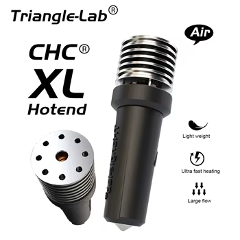

# Hotends

## Overview
This section covers various hotends that are compatible with Voron printers, including their specifications, features, installation guides, and where to purchase them.

## Popular Hotends

### 

| Brand     | Model                       | Description                                    | Photo Spot     | Purchase Link                                |
|-- | --------------------------- | ---------------------------------------------- | -------------- | -------------------------------------------- |
|Phaetus| [Dragon](phaetus-dragon.md) | High-performance Hotend normally using v6 nozzels and can get modorate flow rates | *(Photo here)* | [Buy Dragon ](https://www.phaetus.com/dragon) |
|Phaetus| [Rapido](phaetus-rapido.md) | Fast heating and cooling hotend                | *(Photo here)* | [Buy Rapido ](https://s.click.aliexpress.com/e/_oEt9BS5) |
| E3D | [Revo Voron](e3d-revo-voron.md) | Quick-swap nozzle system | *(Photo here)* | [Buy Revo Voron ](https://e3d-online.com/revo) |
| E3D | [V6](e3d-v6.md)                 | Classic reliable hotend  |  | [Buy V6 ](https://s.click.aliexpress.com/e/_omkZXJR)           |
|dropEffect| [NextG](dropeffect-nextg.md) | High-flow hotend for fast printing | *(Photo here)* | [Buy NextG](https://www.dropeffect.com/nextg) |
|Mellow Fly|[Heatcore 4]()| High-flow hotend using v6 nozzles and with an optional pressure sensing module|!()|[Buy Heatcore 4](https://s.click.aliexpress.com/e/_c3IvQDsR)|
|Mellow Fly|[Goliath]()| Mellow fly's highest flowing hotend, designed for no compromizes and fast printing|!()|[Buy](https://s.click.aliexpress.com/e/_c3IvQDsR)|
|Triangle Labs | CHC XL hotend | Triangle lab's highest flow hotend, with a claimed flow rate over 100 m/s^3 | *()* [Buy](https://s.click.aliexpress.com/e/_c4CCiavl) |

## Selection Guide

### Key Considerations

| Consideration          | Details                                        |
| ---------------------- | ---------------------------------------------- |
| Print Speed (flow rate) | Choose based on desired print speed, it doesn't matter fast your motion system is if you can't melt enough plastic            |
| Material Compatibility (abrasive materials) | Ensure support for intended filaments, if you plan on printing carbon fiber or glass fiber filaments a wear resistance hotend is reconemnd           |
| Cooling Performance    | Check heatsink and fan capabilities            |
| Maintenance Needs      | Consider ease of cleaning and part replacement, pay attention to what type of heate carterage it uses, and what thermistor it uses, this might not be important now but when you want cheap easily available replacement parts, you will be thankful |

## References

1. [Voron Hardware Guide](https://docs.vorondesign.com/hardware.html)
2. [Community Support](https://discord.gg/voron)




