# BigTreeTech EBB Gen 2 Toolhead Boards

The **BigTreeTech EBB Gen 2 series** (EBB36 and EBB42) are compact CAN bus toolhead boards commonly used in Voron and other high-performance 3D printers.  
This page consolidates all setup, firmware flashing, wiring, and configuration. 

## Overview

=== EBB36 GEN2 V1.0

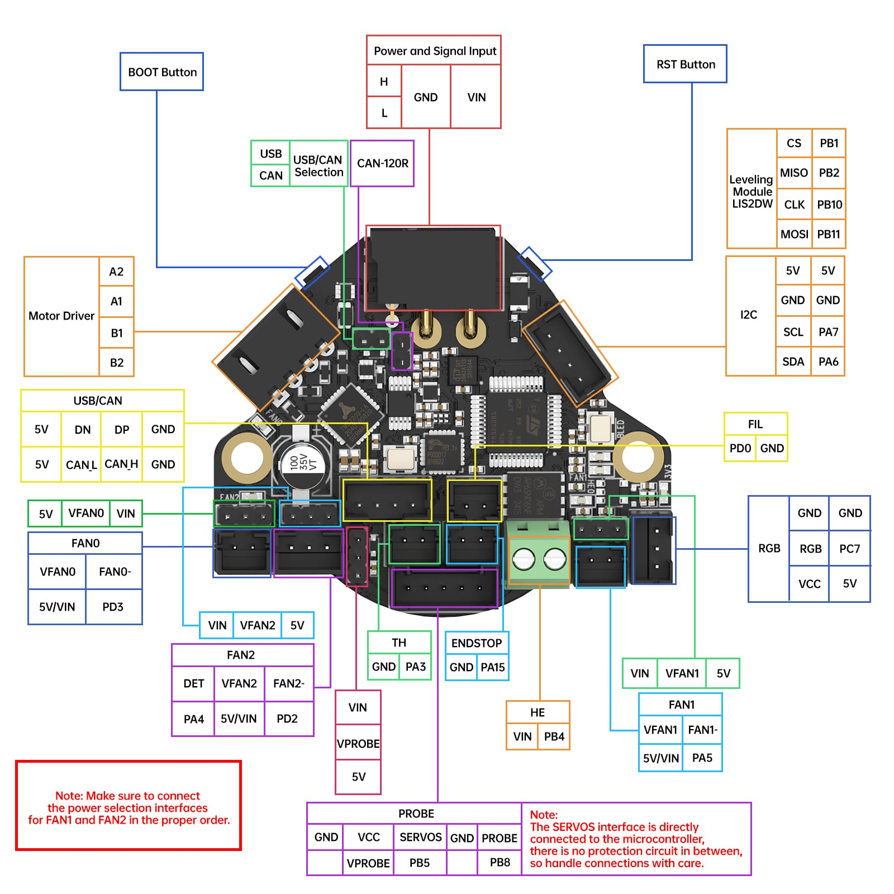{ align=left }

=== EBB42 GEN2 V1.0

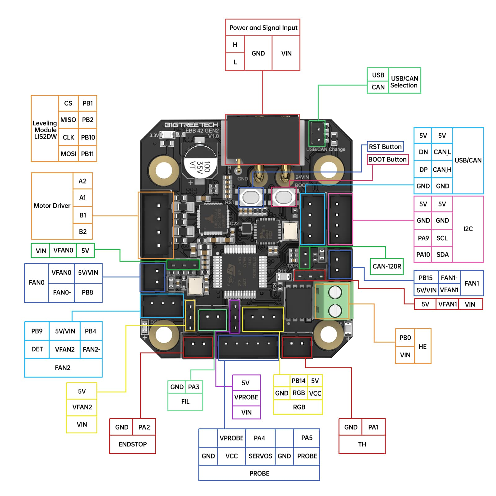{ align=left }

== USB Adapter V1.0

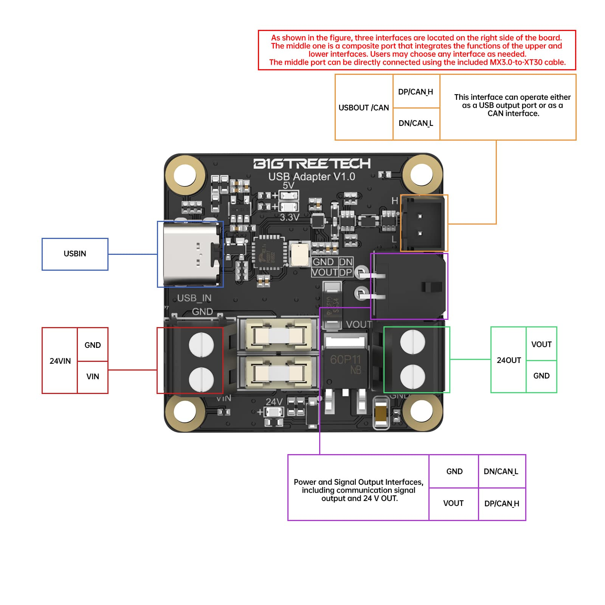{ align=left }

## Gallery

- 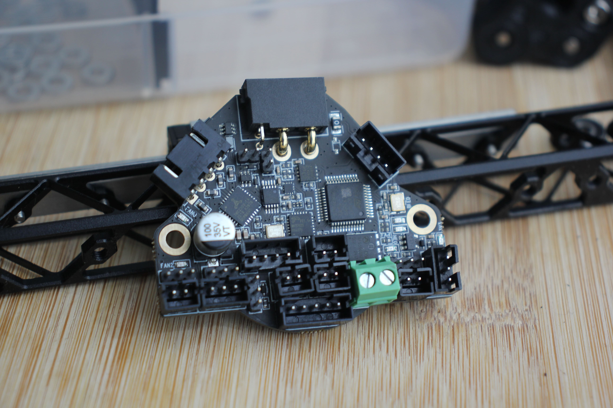
- 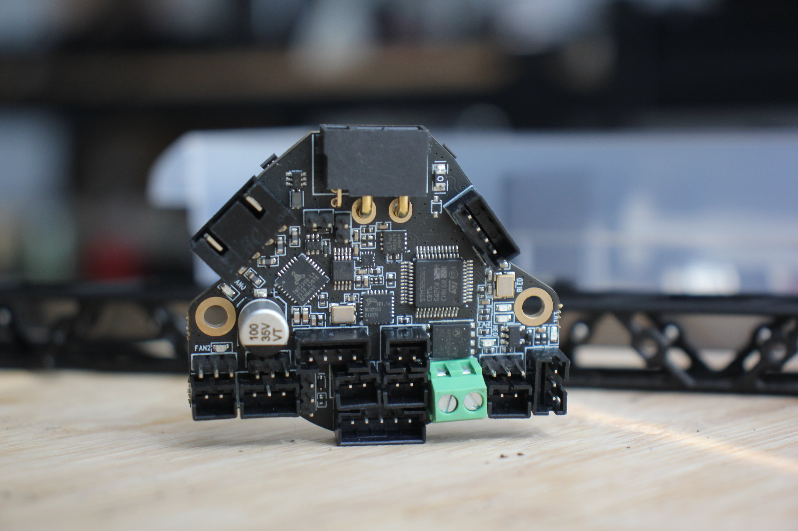
- 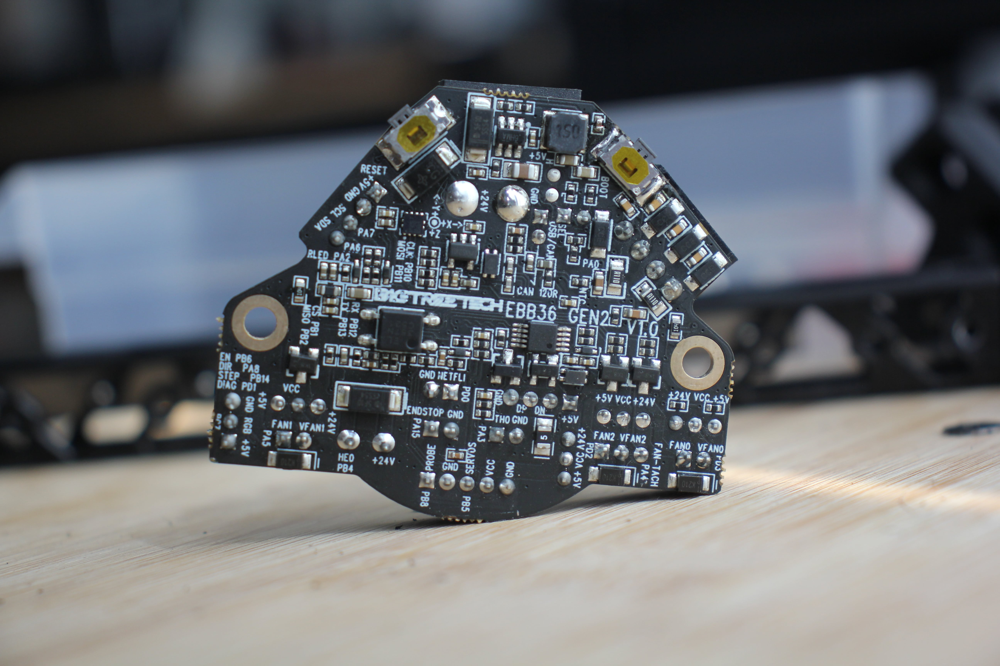
- 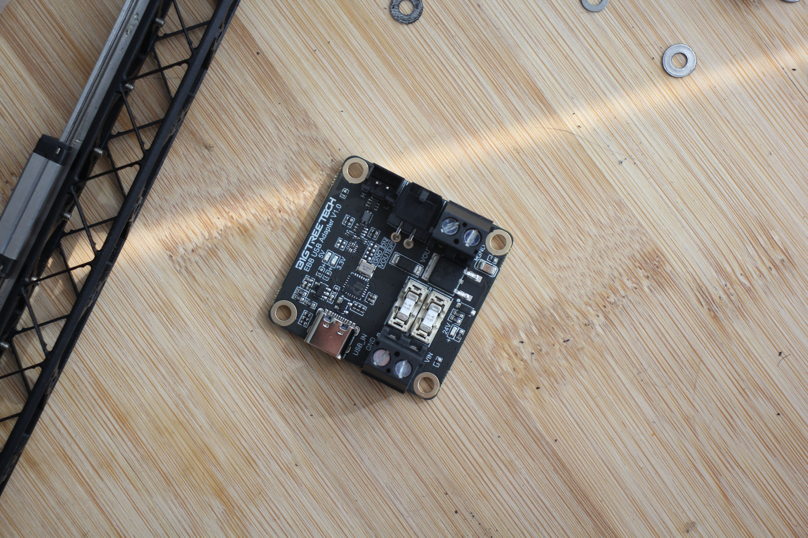
- 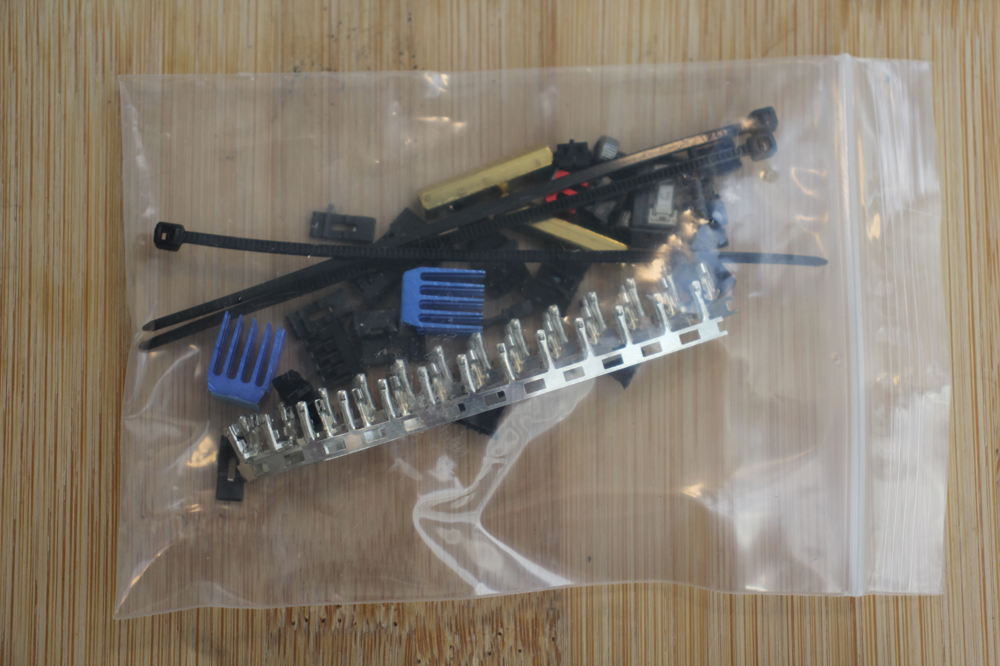
- 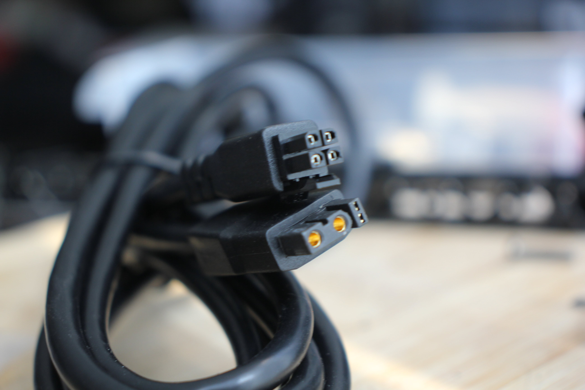
- 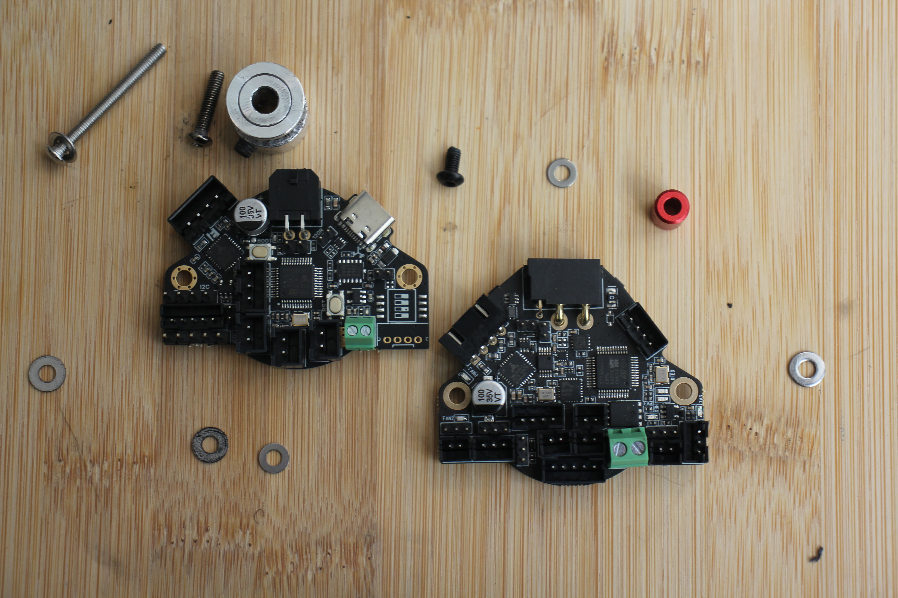
- 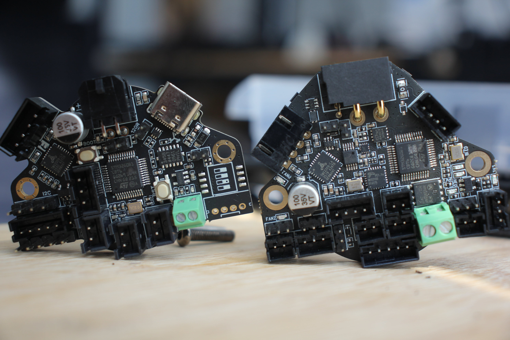
- 
- 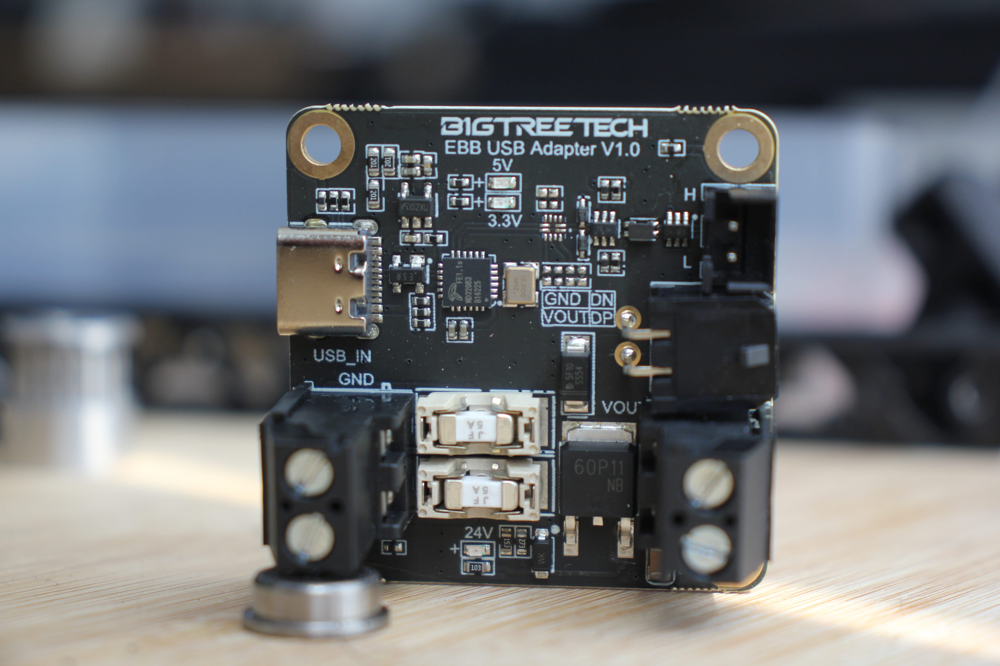
- 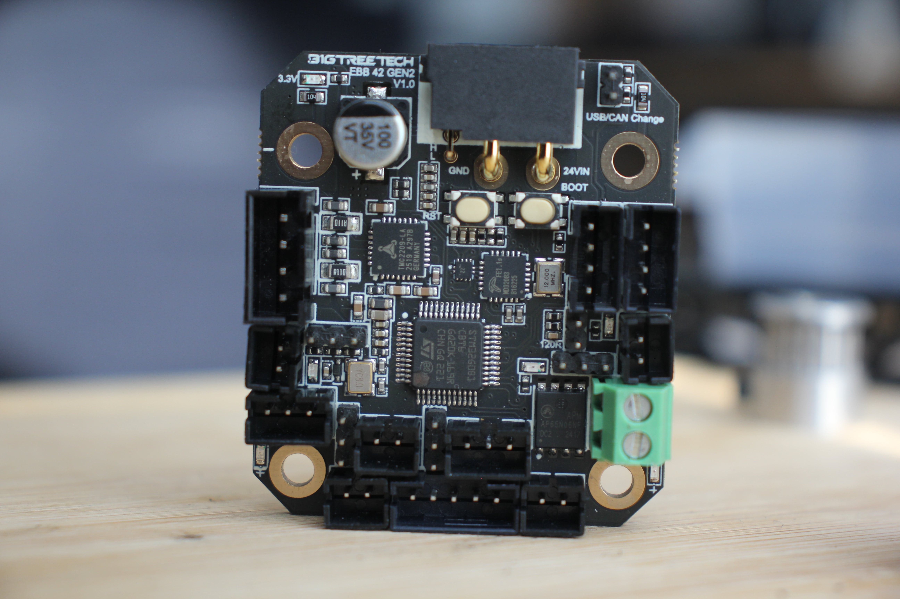
- 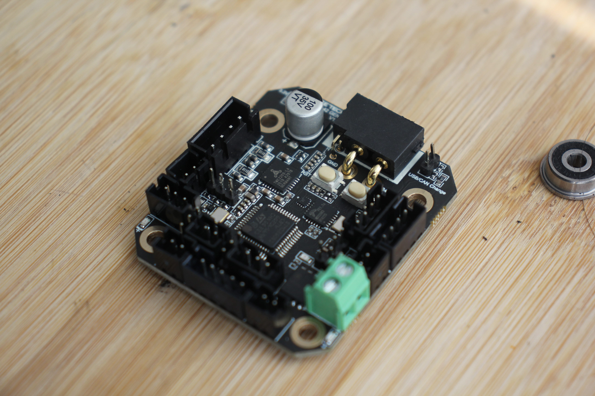

## Specifications

## Features
 
# Installation

# Firmware Flashing

## 1. Enter DFU Mode

## 2. Configure Firmware

## 3. Build Firmware

## 4. Flash Firmware

# Finding CAN UUID

# Klipper Configuration Example

# References


