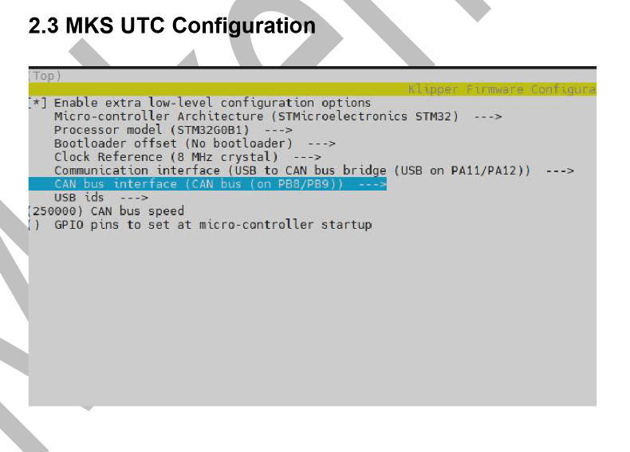
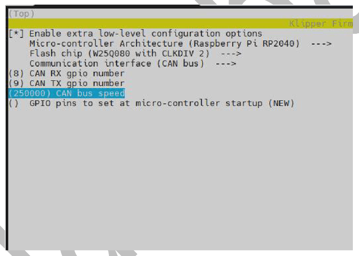

(work in progress more infromation coming soon)

**Configure USB-to-CAN Adapter**
If you have a USB-to-CAN bus adapter, follow these steps to configure it:

**Enter DFU Mode:**
   - Press and hold the **BOOT** button while plugging in the USB-C cable. This will boot the device into DFU (Device Firmware Upgrade) mode.

1. **Access Printer's Linux Interface:**
   - Open a terminal on the printer's Linux interface.

3. **Run the Following Commands:**
   
   **configure firmware USB to canBus addapter:**
       
        - bash
  
        - cd ~

        - make clean  # Optional but ensures no leftover files

        - make menuconfig

   Copy the Config in this photo:

   

         - make  # Build the firmware

         - make flash FLASH_DEVICE=/dev/serial/by-id/[ADD YOUR DEVICE ID HERE]  # Flash to device

   **configure firmware tool head board:**

      - access your printers linux interface and run the following commands

         - cd~

         - make menuconfig

   Copy the Config in this photo:

   

         - make

         - get the klipper.uf2 file that you just generated (klipper/out/klipper.uf2)

         - download that file to different computer

         - turn the printer power off

         - set the usb power jumper to on

         -  while holding the boot button plug the board into a windows (untested on mac) computer, a folder should open, place the klipper.uf2 file you just created in this folder. the folder should close automatically

         - unplug the usb c cable

         - set usb power jumper to off

         - boot the printer



