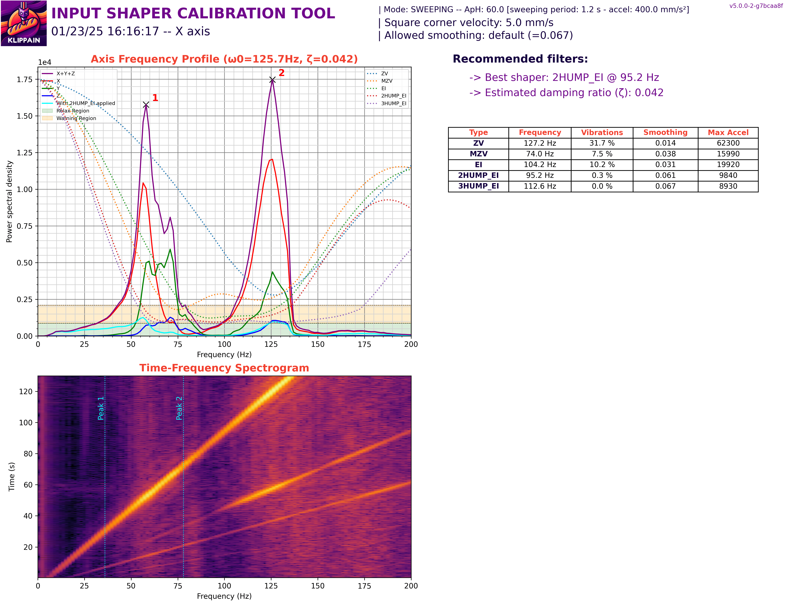
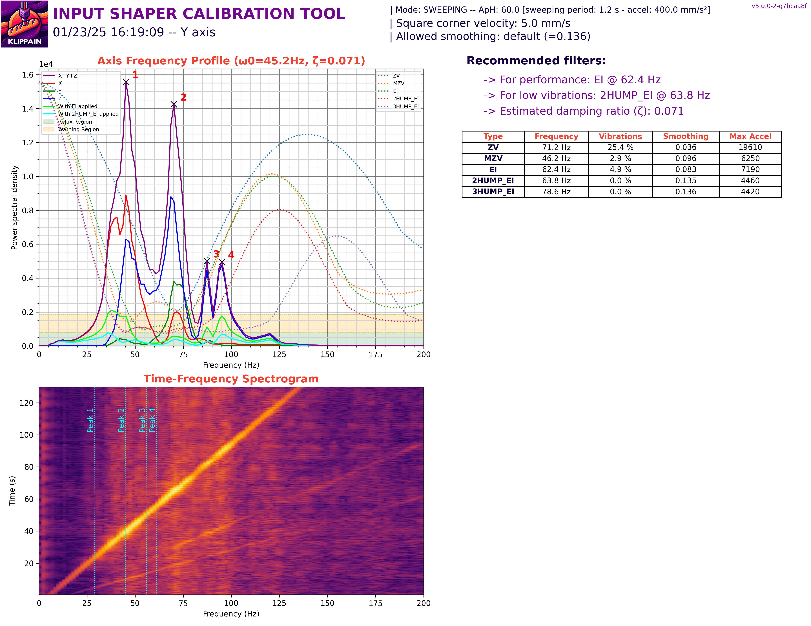

**[klipper Offical](https://github.com/Klipper3d/klipper)**

---

**[kiauh](https://github.com/dw-0/kiauh)**
- tool to help with installing and updating klipper plugins and extentions

---

**[moonraker](https://github.com/Arksine/moonraker)**

---



---

**[mainsail](https://github.com/mainsail-crew/mainsail)**
- webbased GUI for klipper 

---

**[fluidd](https://github.com/fluidd-core/fluidd)**
- webbased GUI for klipper 

---

**[klipperScreen](https://github.com/KlipperScreen/KlipperScreen)**
- A klipper extention that assists with configure a display
- Very helpful for using an old android phone as a klipper control panel

---

**[OctoPrint](https://github.com/OctoPrint/OctoPrint)**

---



---

**[klipper Shake and Tune](https://github.com/Frix-x/klippain-shaketune)**
- This plugin contains a lot of features but it has quite a high learning curve and is ideal for people who want to tune their printers down to the last nanometers
- this can be used to create better input shaper graphs, such as the follow
- X axis Graph:
- 

- Y axis Graph
- 

---



