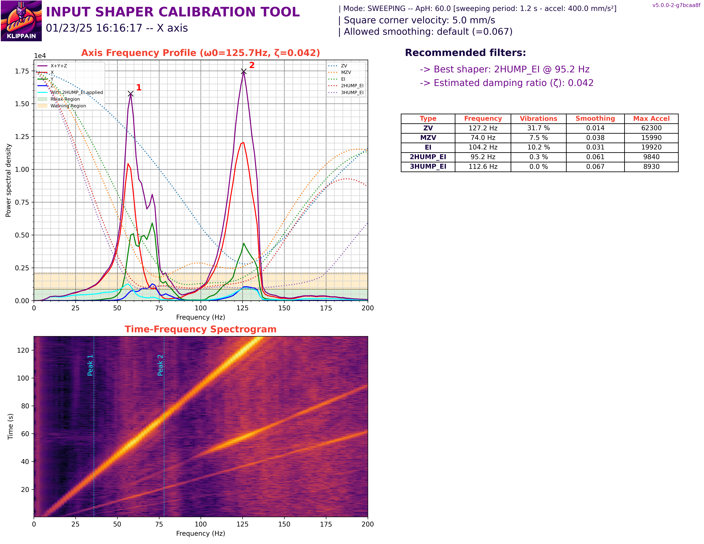
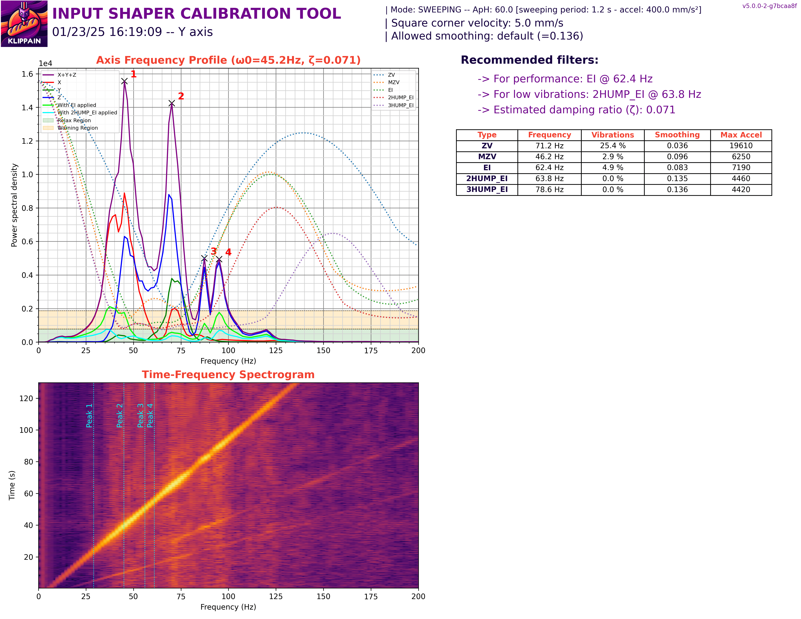

import WorkInProgress from '~/components/WorkInProgress.astro';

Shake&Tune is a Klipper plugin that runs the accelerometer-based resonance tests
and turns them into annotated graphs — belt tension, axis resonance, and input
shaper results — rather than the raw CSVs Klipper produces on its own.

<WorkInProgress />

## Related

- [Klipper](/software/klipper/)
- [Klipper Config Help](/software/klipper-config-help/)
- [Shake&Tune on GitHub](https://github.com/Frix-x/klippain-shaketune)
